# BulkZender

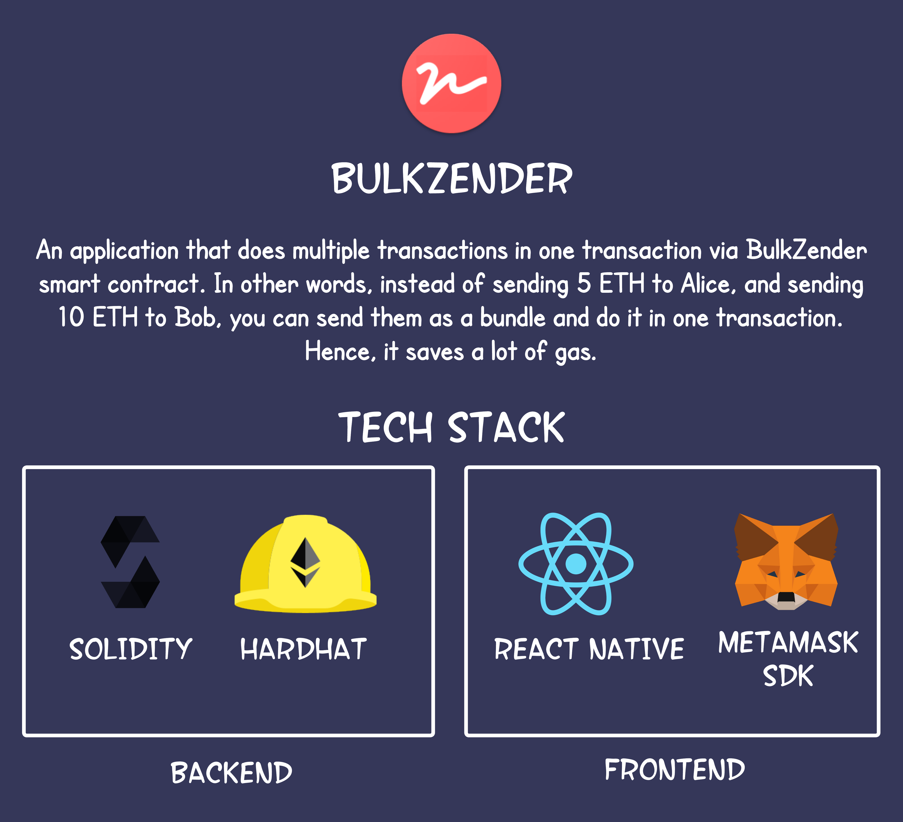

### Background

 &nbsp;&nbsp;&nbsp;&nbsp;&nbsp;&nbsp;It all started, when one day I had to send some tokens to my three friends. I made the transactions then it made me felt like there was lot of duplicated/repetative work. Then I thought, couldn't it have been done in one step? I said why not, let's try. I created a small experiment by myself and check the results. I saw that it works! So I decided to build it more clean and make a small demonstation with hoping it works for someone too. Either in practice, or shed some educational lights. 🔦
It's highly possible that that could be one of the reason of how L2 solutions started. Currently, Optimism and Arbitrum, works in similar way. The actual process could be so different, but the idea is basically the same.

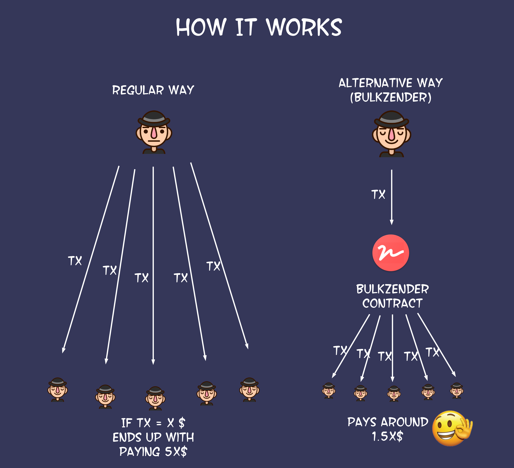

### How it works in practice

|                               First Step                               |                         Second Step                         |                                 Last Step                                 |
| :---------------------------------------------------------------------: | :---------------------------------------------------------: | :------------------------------------------------------------------------: |
|      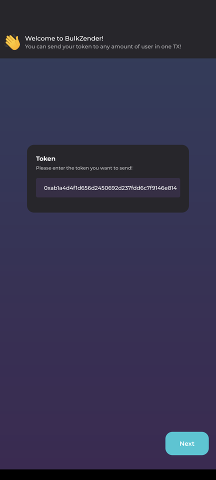      |  |        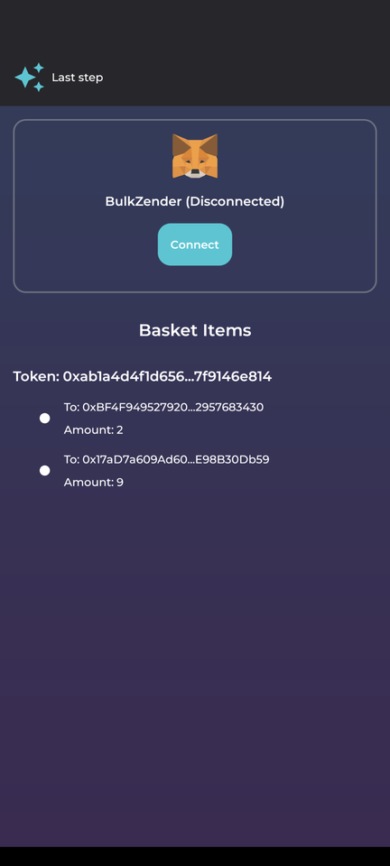        |
| As a first step, we enter the ERC20 token address that we want to send. |   In this step, we can add as many receipents as we want.   | Last step, we connect the metamask, approve and send the<br />transaction. |

### How it works in technical (Nerd alert here 🚨)

Well, solidity code is pretty simple. We have a simple struct here that stands for the every single piece of the indiviual transaction.

<p align="center">
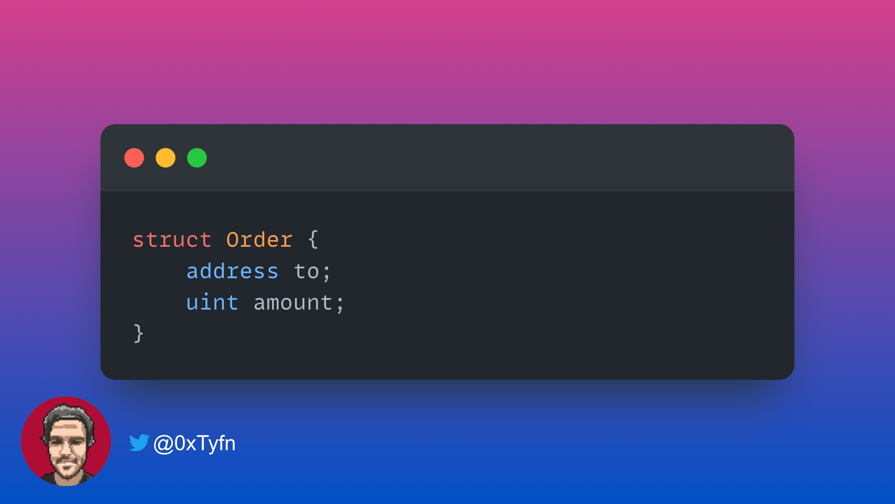
</p>

And we have a function called by `execute`. You can see it as follows,

<p align="center">
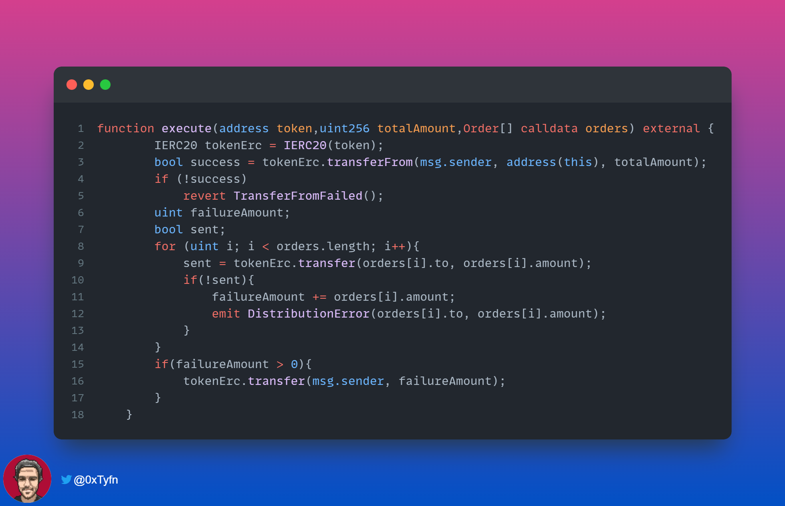
</p>

Calculating the `totalAmount` off-chain instead of inside solidity, seemed way more gas efficient to me. So I decided to go with this way. As you can see,

1. it transfers the totalAmount from the sender to the contract
2. does the necessary checks
3. it loops the orders and distributes the tokens.
4. it emits an event if some distribution fails, and sends total failure amounts back to the sender.

### Gas reports

I have generated these reports by hardhat-gas-reporter plugin. Of course these results may not reflect the real numbers, because the contract could be improved, also the gas usage can be depending on different chains, but they are able to give us an idea about it's efficiency.

| 1 user sent                                           | Result |
| ----------------------------------------------------- | ------ |
| 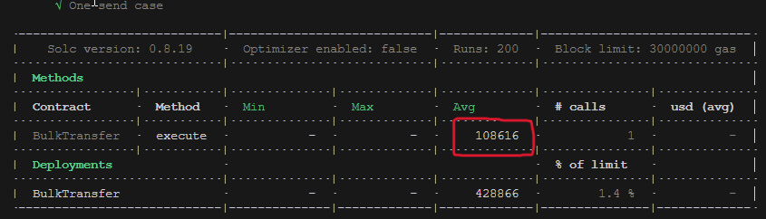 | 108616 |

| 10 user sent                                          | Result |
| ----------------------------------------------------- | ------ |
| 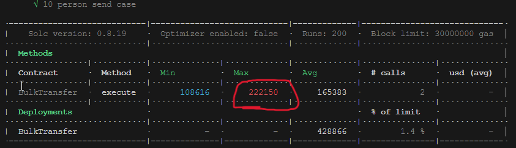 | 222150 |

| 50 user sent                                         | Result |
| ---------------------------------------------------- | ------ |
| 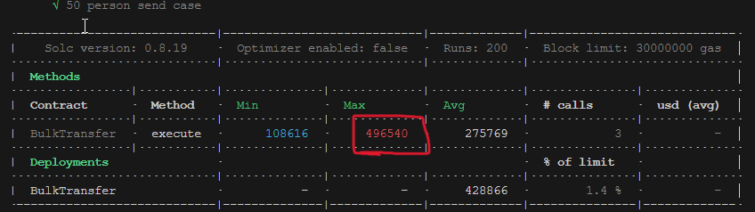 | 496540 |

| 100 user sent                                          | Result |
| ------------------------------------------------------ | ------ |
| 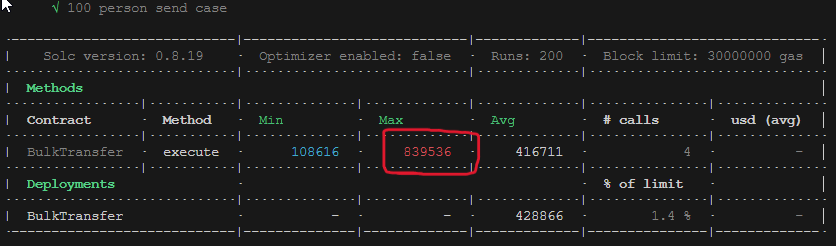 | 839536 |

If we take a look at the general output, the results look very nice!

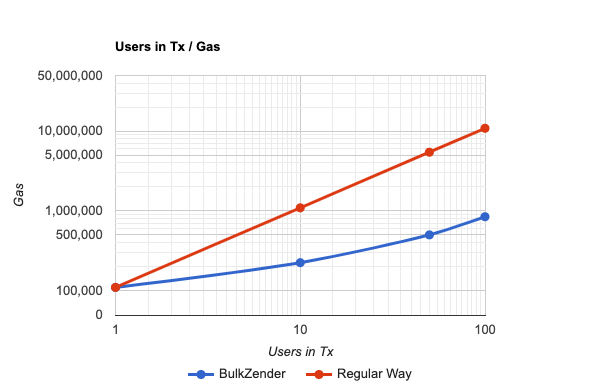

Imagine you decided to airdrop some tokens to your early users. Imagine you would have 100000 users.
This application is a perfect match for these kind of cases.

## What can be done next in this project? 
Well, I have couple of ideas to make this project better but I don't think I would have enough time. So I'll leave it here in case some one would pick them up. Pull requests are more than welcome! 
1. Add Native Gas Token support.
Currently, it can be done by wrapping the native token, (using WETH, WBNB etc.) but it would be nice to add this support and provide better user experience.
2. Add import capability.
Since we are talking about sending bulk, entering all the inputs manually is a pain. It would be so cool to add some import feature. It could be from excel or some csv file.


## Disclaimer

This project is a demonstration of the idea. It may not suit the real life usecase well due to lack of useful capabilities as such.
This project was created for educational purposes only. It's not ready for production and should not be used in production. This project is a result of my experiments and it is not responsible for any damage, loss of funds or misusage. It has not been deployed to any mainnets.

## About the author

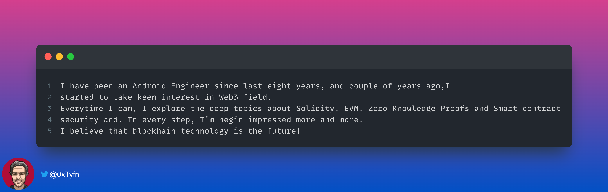

## Licence

```
Copyright 2023 Tayfun CESUR

Licensed under the Apache License, Version 2.0 (the "License");
you may not use this file except in compliance with the License.
You may obtain a copy of the License at

   http://www.apache.org/licenses/LICENSE-2.0

Unless required by applicable law or agreed to in writing, software
distributed under the License is distributed on an "AS IS" BASIS,
WITHOUT WARRANTIES OR CONDITIONS OF ANY KIND, either express or implied.
See the License for the specific language governing permissions and
limitations under the License.
```
